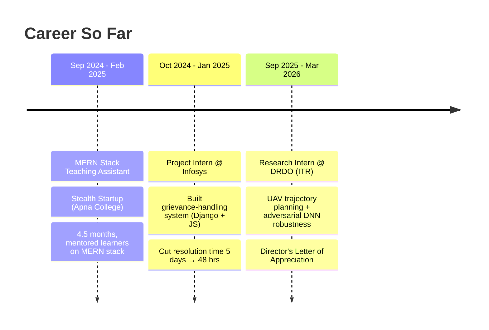

<div align="center">


<!-- Typing intro -->


<br>


</div>

<table>
<tr>
<td width="60%" valign="top">

### 🧭 About Me

I'm a Computer Science undergrad at **JNTU Hyderabad** (CGPA `8.74`) who builds
end-to-end products — **Java + React** on the core stack, backed by
production-grade infra — from a competitive-programming tracker serving
**1,500+ active users at 99.8% uptime**, to a from-scratch
**Amazon Dynamo–style key-value store** across a 5-node gRPC cluster.

- 🛰️ Currently building UAV trajectory-planning & adversarial DNN robustness systems as a **Research Intern @ DRDO (Integrated Test Range)**
- 🏗️ Deep into **full stack engineering, distributed systems, and cloud reliability**
- 🤖 Ship faster by pairing with AI — Claude Code, Cursor, Copilot & co. are basically teammates now
- 📊 Real-time monitoring nerd — Prometheus dashboards make me happy
- 🧩 **450+ DSA problems solved** • Global Rank **89 / 20,000+** on CodeChef Starters 118
- 🎯 Looking for **Full Stack Developer** roles — Java/React product engineering with cloud & AI-assisted workflows
- ⚡ Fun fact: I once cut AWS costs by **35%** just by *not* being serverless

</td>
<td width="40%" valign="top" align="center">

```
> whoami
Harshavardhan Muddada
Hyderabad, India

> uptime
99.8% (CodeStats prod)

> latency
p50 1.2ms (DistributedDB)

> status
Open to Full Stack Roles ✅
```

</td>
</tr>
</table>

<br>

## 🛠️ Tech Arsenal

<div align="center">

**Core — Java + React**
<br>


**Other Languages**
<br>


**Cloud & Backend**
<br>


**Data & DevOps**
<br>


**AI & Vibe Coding**
<br>


**Design**
<br>


</div>

<br>

## 🚀 Flagship Builds

<table>
<tr>
<td width="50%" valign="top">

### 📈 [CodeStats](https://github.com/Harsha19-08)
**Full-Stack Competitive Programming Tracker**

Event-driven architecture with **database sharding + replica sets**
for horizontal scale.

- ⚡ `3x` faster leaderboards via Redis caching
- 👥 Scaled to **1,500+ active users** @ **99.8%** uptime
- 💰 Cut AWS infra cost by **35%** (Serverless → EC2 migration)

`AWS` `Redis` `Sharding` `Event-Driven`

</td>
<td width="50%" valign="top">

### 🗄️ [DistributedDB](https://github.com/Harsha19-08)
**Distributed Key-Value Store (Dynamo internals)**

Consistent hashing, quorum replication, gossip failure detection,
WAL crash recovery — across a **5-node gRPC cluster**.

- 🏎️ `850 ops/sec` at **1.2ms p50 latency**, zero errors
- ✅ Verified with **30+ JUnit 5** integration tests
- 📡 Live Prometheus observability

`gRPC` `Consensus` `Prometheus` `JUnit5`

</td>
</tr>
</table>

<br>

## 💼 Experience Timeline



> 🏢 **Stealth Startup (Apna College)** — MERN Stack Teaching Assistant, *Sep 2024 – Feb 2025*
> Yes, **that** Apna College — Shradha Khapra's ed-tech venture. Spent 4.5 months as a TA helping learners actually get MERN stack concepts to click, not just copy-paste from a tutorial.

<br>

## 🏆 Achievements

| Category | Highlight |
|---|---|
| 🥇 Competitive Programming | Global Rank **89 / 20,000+**, CodeChef Starters 118 |
| 🧠 Problem Solving | **450+ problems** solved across LeetCode & DSA |
| 🏅 Hackathons | Winner — **Zignasa**, **FrostHacks** • Finalist — **GFG Hackathon** |
| 🎖️ Recognition | Director's Letter of Appreciation — **DRDO, Integrated Test Range** |
| 📜 Certifications | **AWS Certified Cloud Practitioner** • OCI AI Foundations Associate • Postman API Student Expert |
| 👨‍👩‍👧‍👦 Community | Lead, **Google Developer Groups @ MLRIT** (500+ members, 5+ workshops) |

<br>

## 📊 GitHub Analytics

<div align="center">


</div>

<br>

## 😄 A Little Honesty

<div align="center">

| Recruiter sees | Reality |
|---|---|
| "450+ DSA problems solved" | also solved 450+ ways to get a `NullPointerException` |
| "99.8% uptime" | the 0.2% was me pushing to prod on a Friday |
| "AI-native builder" | 40% coding, 60% convincing Claude Code I *actually* wanted semicolons |
| "gRPC across 5-node cluster" | node 6 doesn't exist, it's a personal grudge |
| "Open to Full Stack roles" | will `git commit -m "fix"` at 2 AM without hesitation |

</div>

```java
public class Me {
    public static void main(String[] args) {
        while (!hired) {
            buildCoolStuff();
            breakProdOnce();
            fixItFaster();
        }
        System.out.println("Let's ship something great together 🚀");
    }
}
```

<br>

## 📬 Let's Connect

<div align="center">

[](https://linkedin.com/in/harsh199)
[](mailto:mharshavardhan@gmail.com)
[](https://github.com/Harsha19-08)


</div>

<div align="center">
<sub>💡 Open to <b>Full Stack Developer</b> roles — Java + React product engineering, cloud infra, and AI-assisted delivery.</sub>
</div>
